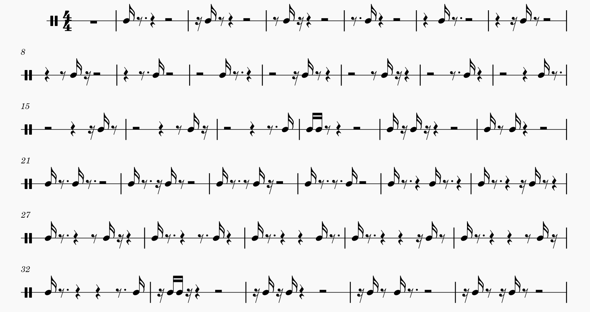

# Drum Pattern Generator

## Overview
This script generates all possible drum patterns for a given number of semiquavers (16th notes) and saves them as MusicXML files, which can be opened in notation software like MuseScore, Finale, or Sibelius.

### What it does:
- Creates every possible combination of hits and rests for a given number of beats.
- Organizes patterns by the number of notes, making it easier to explore rhythmic variations.
- Saves them in MusicXML format for easy editing and playback in notation software.
- Splits the patterns into multiple files if the produced file would be too large (see `MAX_PATTERNS_PER_FILE` in the code).

## How to Use
### Requirements
- Python 3
- The `lxml` library (install it with `pip install lxml`)

### Running the Script
```sh
python generate_partitions.py <N> [max_patterns_per_file]
```
- `<N>`: Number of semiquavers (16th notes) in each pattern (e.g., 8 for one bar in 4/4 time).
- `[max_patterns_per_file]` (optional): The maximum number of patterns per file.

Example:
```sh
python generate_partitions.py 16
```
This will generate all possible 16-note drum patterns and save them as `16` MusicXML files. Each file contains `MAX_PATTERNS_PER_FILE=4096` patterns.
Here are the first 36 patterns after using the _Regroup rhythms_ tools in MuseScore:


## Opening the MusicXML Files
1. Open the `.musicxml` files in notation software like MuseScore, Finale, or Sibelius.
2. Play back and modify the patterns to create your own grooves.
3. Experiment with different subdivisions and note combinations to discover new rhythmic ideas!

**Note:** The output can be easily written to separate files because (at least with musescore) opening files with at more than 2048 measures was challenging.

![ex]

## Why Use This?
This tool is great for:
- Drummers looking for fresh rhythmic ideas.
- Composers and arrangers wanting structured rhythm variations.
- Music educators teaching rhythm and pattern recognition.

Happy drumming!


